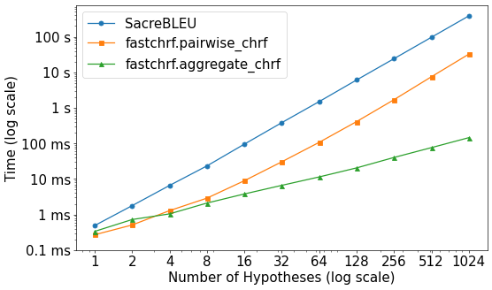

[](https://github.com/jvamvas/fastchrf/actions/workflows/unittest.yml)
[](https://pypi.python.org/pypi/fastchrf/)

# fastChrF

Fast computation of sentence-level ChrF, motivated by Minimum Bayes Risk decoding.

* **ChrF** ([Popović, 2015](https://aclanthology.org/W15-3049/)) is a string similarity metric based on character overlap.
* **Minimum Bayes Risk (MBR) decoding** is a strategy for generating text from a language model that requires many pairwise comparisons of strings.


## Installation
```bash
pip install fastchrf
```

## Usage
### Parallelized computation of pairwise ChrF scores
Use the `fastchrf.pairwise_chrf` function to compute the ChrF score between each hypothesis and each reference in a set of hypotheses and references:

```python
from fastchrf import pairwise_chrf

hypotheses = ["The cat sat on the mat.", "The cat sat on the hat."]
references = ["The cat sat on the mat.", "The fat cat sat on the mat.", "A cat sat on a mat."]
pairwise_scores = pairwise_chrf([hypotheses], [references])

print(np.array(pairwise_scores))
# [[[100.          74.6319046   55.77074432]
#   [ 79.65373993  57.15287399  50.72182846]]]
```

* `pairwise_chrf` works with a **batch dimension**, so pass a list of lists of hypotheses and a list of lists of references.
* For each row in the batch, the function calculates the segment-level ChrF score between each hypothesis and each reference.
* The output has shape `(batch_size, num_hypotheses, num_references)`.

### Faster alternative: A streamlined ChrF variant for MBR

`fastchrf.pairwise_chrf` compares each hypothesis to each reference.
This is slow when the number of hypotheses and references is large, as is the case in MBR decoding.
`fastchrf.aggregate_chrf` computes a streamlined variant of ChrF that is faster to compute:

```python
from fastchrf import aggregate_chrf

hypotheses = ["The cat sat on the mat.", "The cat sat on the hat."]
references = ["The cat sat on the mat.", "The fat cat sat on the mat.", "A cat sat on a mat."]
aggregate_scores = aggregate_chrf([hypotheses], [references])

print(np.array(aggregate_scores))
# [[78.56389618 63.3719368 ]]
```

* `aggregate_chrf` does not output individual scores for each reference. Instead, it outputs an **aggregate score across references**.
* The output has shape `(batch_size, num_hypotheses)`.
* The aggregate score is **not equal** to the average of the individual scores, nor is it equal to standard multi-reference ChrF. See below for a formal description.

## Function Signatures

```python
def pairwise_chrf(hypotheses: List[List[str]], references: List[List[str]], char_order: int=6, beta: float=2.0, remove_whitespace: bool=True, eps_smoothing: bool=False) -> List[List[List[float]]]:
    """
    Returns a matrix of pairwise ChrF scores of shape batch_size x num_hypotheses x num_references
    
    :param hypotheses: A list of lists of hypotheses of shape batch_size x num_hypotheses
    :param references: A list of lists of references of shape batch_size x num_references
    :param char_order: An integer indicating the maximum order of the character n-grams. Defaults to 6.
    :param beta: A float indicating the beta parameter of the F-score. Defaults to 2.0.
    :param remove_whitespace: If `True`, remove whitespace when extracting character n-grams. Defaults to `True`.
    :param eps_smoothing: If `True`, add epsilon smoothing to the ChrF score. Defaults to `False`.
    :return: A list of lists of lists of floats.
    """

def aggregate_chrf(hypotheses: List[List[str]], references: List[List[str]], char_order: int=6, beta: float=2.0, remove_whitespace: bool=True, eps_smoothing: bool=False) -> List[List[float]]:
    """
    Returns a matrix of fastChrF scores of shape batch_size x num_hypotheses

    :param hypotheses: A list of lists of hypotheses of shape batch_size x num_hypotheses
    :param references: A list of lists of references of shape batch_size x num_references
    :param char_order: An integer indicating the maximum order of the character n-grams. Defaults to 6.
    :param beta: A float indicating the beta parameter of the F-score. Defaults to 2.0.
    :param remove_whitespace: If `True`, remove whitespace when extracting character n-grams. Defaults to `True`.
    :param eps_smoothing: If `True`, add epsilon smoothing to the ChrF score. Defaults to `False`.
    :return: A list of lists of lists of floats.
    """
```

## Formal Description
Sentence-level ChrF ([Popović, 2015](https://aclanthology.org/W15-3049/)) compares two strings by counting the number of character n-grams that they have in common.

Given a hypothesis $\textrm{hyp}$ and a reference $\textrm{ref}$, ChrF internally represents them as bags of character n-grams.
Think of a Python `Counter` object that maps each n-gram to its count in the string.

Three operations on bags of n-grams are relevant for ChrF:

1. **Cardinality**: The number of n-grams in the bag. This is denoted by $|\text{hyp}|$ and $|\text{ref}|$, respectively.
2. **Intersection**: Creating a bag that for each n-gram contains the smaller of the two counts in the hypothesis and the reference. We denote this by $\textrm{hyp} \cap \textrm{ref}$.
3. **Sum**: Creating a bag that for each n-gram contains the sum of the counts in the hypothesis and the reference. We denote this by $\textrm{hyp} \uplus \textrm{ref}$.

The standard ChrF score is an F-score that combines precision and recall of character n-grams:

```math
\textrm{ChrF} = \frac{(1 + \beta^2) \cdot \textrm{ChrP} \cdot \textrm{ChrR}}{\beta^2 \cdot \textrm{ChrP} + \textrm{ChrR}},
```

where
```math
\text{ChrP} = \frac{\textrm{hyp} \cap \textrm{ref}}{|\textrm{hyp}|}
```
and
```math
\text{ChrR} = \frac{\textrm{hyp} \cap \textrm{ref}}{|\textrm{ref}|}.
```
(The parameter $\beta$ controls the relative importance of precision and recall.)

### fastchrf.pairwise_chrf
Calculating pairwise ChrF scores is relevant for sampling-based MBR [(Eikema & Aziz, 2022)](https://aclanthology.org/2022.emnlp-main.754/), where many samples and references are generated and then the sample with the highest expected utility is selected.

If ChrF is used as the utility metric for MBR, the expected utility of $\textrm{hyp}$ is calculated as the average ChrF score between $\textrm{hyp}$ and the set of references $R$:

```math
\textrm{utility}_{\textrm{ChrF}}(\textrm{hyp}) = \frac{1}{|R|} \sum_{\textrm{ref} \in R} \textrm{ChrF}(\textrm{hyp}, \textrm{ref}).
```

Unfortunately, the number of intersections $\textrm{hyp} \cap \textrm{ref}$ that need to be calculated is quadratic in the number of hypotheses and references.

### fastchrf.aggregate_chrf

The idea behind `fastchrf.aggregate_chrf` is to first create an "average" reference $\overline{\textrm{ref}}$ by averaging the bags of n-grams in $R$:

```math
\overline{\textrm{ref}} = \frac{1}{|R|} \biguplus_{\textrm{ref} \in R} \textrm{ref}.
```

The utility is then calculated as the ChrF score between $\textrm{hyp}$ and $\overline{\textrm{ref}}$:

```math
\textrm{utility}_{\textrm{fastChrF}}(\textrm{hyp}) = \textrm{ChrF}(\textrm{hyp}, \overline{\textrm{ref}}).
```

Because $\overline{\textrm{ref}}$ is the same for every $\textrm{hyp}$, the number of bag-of-ngram operations that need to be performed is now linear in the number of hypotheses. However, note that this formulation clearly differs from textbook ChrF. The functions $`\textrm{utility}_{\textrm{ChrF}}`$ and $`\textrm{utility}_{\textrm{fastChrF}}`$ are not equivalent.

## Benchmarking

* Up to 1024 medium-size hypotheses/references in German
* Batch size 1
* 64-core CPU

|    n | [SacreBLEU](https://github.com/mjpost/sacrebleu) (ms) | `fastchrf.pairwise_chrf` (ms) | `fastchrf.aggregate_chrf` (ms) |
|-----:|---------------:|----------------------------:|-----------------------------:|
|    1 |        0.49 ms |                     0.27 ms |                      0.34 ms |
|    2 |        1.77 ms |                     0.51 ms |                      0.72 ms |
|    4 |        6.56 ms |                     1.28 ms |                      1.04 ms |
|    8 |       23.28 ms |                     2.88 ms |                      2.10 ms |
|   16 |       95.18 ms |                     8.92 ms |                      3.78 ms |
|   32 |      382.58 ms |                    30.33 ms |                      6.60 ms |
|   64 |     1497.29 ms |                   106.99 ms |                     11.39 ms |
|  128 |     6062.98 ms |                   409.86 ms |                     20.44 ms |
|  256 |    24072.80 ms |                  1691.64 ms |                     40.17 ms |
|  512 |    96216.99 ms |                  7465.06 ms |                     75.94 ms |
| 1024 |   383965.22 ms |                 32262.39 ms |                    144.78 ms |




> [!CAUTION]
> fastChrF is not intended to be used as an evaluation metric. For evaluating NLG systems with the ChrF metric, use the implementation provided by [sacreBLEU](https://github.com/mjpost/sacrebleu) instead.
